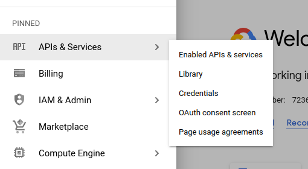

# Python Code to interact with Gmail via Google API
This repo is for a challenge undertaken as a test for a Data Engineering position, originally found at this link: https://github.com/haensel-ams/recruitment_challenge/tree/master/DevOps_201909.

The instructions below show you how to use this repo more - if you have any questions or concerns, please raise an issue on this repo and the author will get back to you soon!

---

## What does this code do?
This code allows you to interact with Gmail just from using a Python script without having to use Gmail from your web browser. Exciting!

Currently this code only supports the following functionalities, but more may be added in the future:
- Compose & send emails
- Search through your Gmail inbox to find specific messages

---

## How can I use this code?

### Step 1: Setting up your Google Cloud Project
Using the Google API means that you need your own Google Cloud Project.
This is what allows Google to expose access to parts of your Google account to APIs - and helps you manage authentication.
You can follow [Google's instructions to set up a Google Cloud Project](https://developers.google.com/workspace/guides/create-project).

---

### Step 2: Enable the Gmail API on your Project
1. Follow [Google's instructions to enable Google Workspace APIs](https://developers.google.com/workspace/guides/enable-apis) to locate where you can activate the Gmail API
2. Once you see the page below, click the 'Gmail API' and then click 'Enable'  

---

### Step 3: Setting up OAuth authentication
Google offers a few ways to authenticate API calls, but for using Gmail specifically without a Google Workspace account, OAuth is the best choice (see `devnotes.md` for a discussion of this topic).
1. In your Project, find the "Credentials" menu within "APIs & Services" 
2. Click 'Create Credentials' at the top menu and then select "OAuth client ID"
3. Select the application type "Desktop app" and then click "Create"
4. The OAuth client will be created and a pop-up will offer you a chance to download the credentials as a JSON file. Do this and move this file to a secure location on your computer.

---

### Step 4: Setting up this code on your computer
1. [Download and install Python](https://www.python.org/downloads/) if you haven't already
2. Clone this Github repository using Git, or download it as a zip file and unpack it in a folder on your computer.
3. Run startup.sh to install dependencies
   1. different shell script needed for Windows / Mac machines? I should either provide CMD / Mac terminal scripts or specify manual instructions for these use cases

### Step 3: Running this code:
1. See the 'quickstart.py' script for some examples of how you can use the code (THIS SHOULD HAVE EXAMPLES OF USING CLASSES FOR API NEEDS)

---

