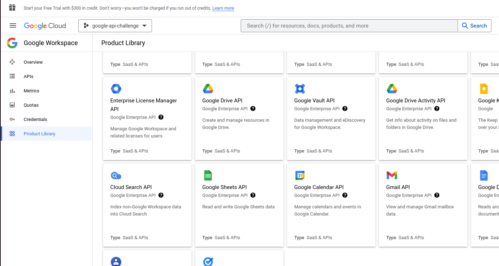
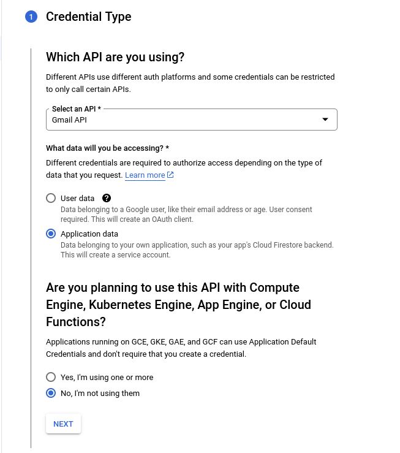

# Python Code to interact with Gmail via Google API
This repo is for a challenge undertaken as a test for a Data Engineering position, originally found at this link: https://github.com/haensel-ams/recruitment_challenge/tree/master/DevOps_201909.

The instructions below show you how to use this repo more - if you have any questions or concerns, please raise an issue on this repo and the author will get back to you soon!

---

## What does this code do?
This code allows you to interact with Gmail just from using a Python script - meaning that you can craft and send emails, as well as search and find past conversations, without having to log into Gmail from your web browser. Exciting!

More text here...

---

## How can I use this code?
[wip]

### Step 1: Setting up your Google Cloud Platform
Using the Google API means that you need your own Google Cloud Platform [MORE_HERE]...
...
...

### Step 2: Setting up this code on your computer
1. Get Python
2. Clone Repo using Git or download and unpack
3. Run startup.sh to install dependencies
   1. different shell script needed for Windows / Mac machines? I should either provide CMD / Mac terminal scripts or specify manual instructions for these use cases

### Step 3: Running this code:
1. See the 'quickstart.py' script for some examples of how you can use the code (THIS SHOULD HAVE EXAMPLES OF USING CLASSES FOR API NEEDS)

---

## ROUGH GCP SETUP NOTES (refine later)

### 1. Set up Google Cloud Project
1. Follow [Google's instructions to set up a Google Cloud Project](https://developers.google.com/workspace/guides/create-project)

### 2. Enable Gmail API for your Google Cloud Project
1. Follow [Google's instructions to enable Google Workspace APIs](https://developers.google.com/workspace/guides/enable-apis) to locate where you can activate the Gmail API
2. Once you see the page below, click the 'Gmail API' and then click 'Enable'  

---

### 3. Create Service Account

1. After you enable the Gmail API, click the "Create Credentials" button at the top of the screen. If you don't, try navigating to your [Gmail API metrics page](https://console.cloud.google.com/apis/api/gmail.googleapis.com/metrics).
2. In the following page, select the **Gmail API**, that you are using **Application data**, and that you are **not** using Compute Engine or other Google-managed cloud services (see image below). Click "next". 
3. In the Service Account page, give your service account a name and a description to help you keep track of what it is for. Then click "Create and Continue".
4. `DO I NEED TO GRANT EXTRA ACCESS TO MY SERVICE ACCOUNT TO ACCESS MY GCP? TEST FIRST AND FINISH THESE NOTES ONCE I KNOW FOR SURE`
5. Click 'Done' at the bottom of the page and head to [your credentials page](https://console.cloud.google.com/apis/credentials). You should see your new service account.

>[Read more about Google Service Accounts](https://cloud.google.com/iam/docs/service-account-overview)

---

### 4. Create and download key for Service Account
1. Click your newly created service account from the [Credentials page](https://console.cloud.google.com/apis/credentials).
2. At the top menu, select "Keys" and then click the 'Add Key' button. Choose the JSON key type.
3. Your key JSON file will automatically download - store this in a secure location on your machine.

---

### 5. Set up application 